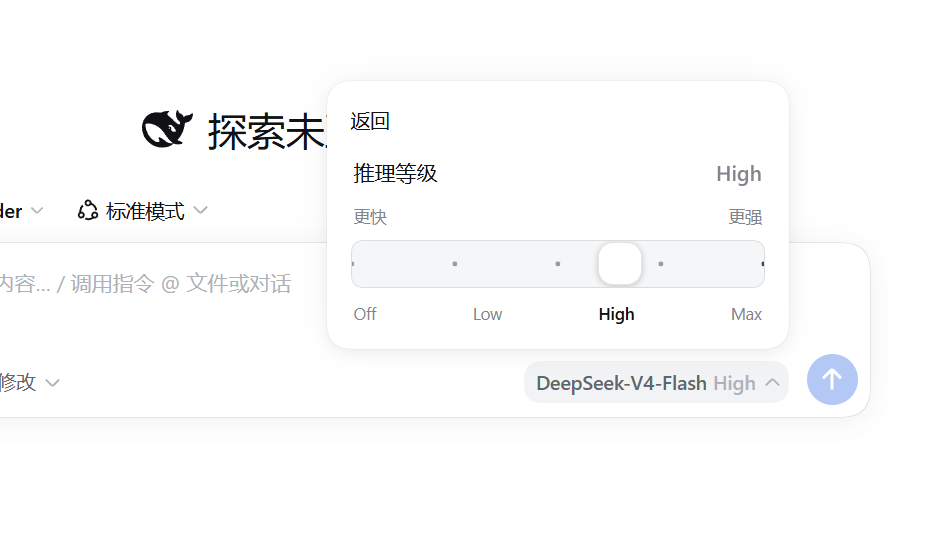
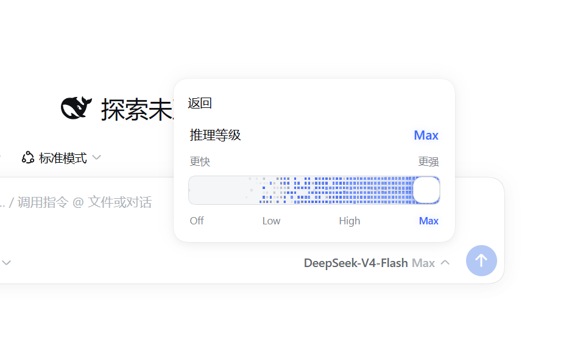

# dsh-effort-slider

给 DeepSeek Harness Web 界面**就地替换**思考强度控件：DSH 原生在「模型座位 → 弹层 →
推理等级/Effort」面板里用一组单选行（Default / Off / Low / High / Max）选择思考强度；
本插件监视该面板，面板一打开就把原生单选行替换成参考 Claude Effort 卡片 /
`claude-range-slider` 项目的美观滑块：

- DSH 原生菜单字号、间距、圆角和主题变量 + 状态字动画 + 更快/更强发光轨道；
- 拖到最右 **Max**，轨道内燃起 DeepSeek 蓝 **WebGL 火焰**（参考项目 4-pass 火焰模拟的
  vanilla 移植；无 WebGL 时自动回退为 CSS 辉光）；
- 选择仍走 DSH 官方链路：点击隐藏的原生档位行，执行会话级 `selectModel`、默认保存
  和座位标签更新，但只抑制 `chooseEffort()` 成功结算时的强制关窗；保存前后面板保持
  原位，不闪烁、不回弹。
- 自动适配 DSH 深色/浅色主题，并提供「返回」按钮回到模型与思考强度主菜单。

> 档位含义与官方一致（`off | low | high | max`）。原生的 Default 档会被标出
> 「Default · 跟随模型」，并提供「恢复默认」按钮。

## 效果预览

### High 档



### Max 档



## 它做了什么

| 层 | 实现 |
|---|---|
| 宿主插件（Node） | `lib/index.js`：把 `web/widget.js` 注入界面 HTML；提供 `/dsh-effort-slider/state.json`（档位元数据） |
| 浏览器端 | `web/widget.js`：监视「模型座位」弹层，就地替换「推理等级」面板内容（零依赖、无打包） |
| 写入语义 | **不另发请求** —— 点击原生档位行，保留会话级 selectModel、默认保存和事件投影，只跳过成功后的 close 回调 |
| 兜底 | 面板结构识别不到、无推理能力模型、或 WebGL 不可用时，原生 UI 原样保留，绝不破坏界面 |

## 安装

需要已安装 DSH（`dsh` 命令可用）。推荐安装已发布的预构建包：

```powershell
dsh plugin --profile web add https://github.com/SmailPang/dsh-effort-slider/releases/download/v0.1.1/dsh-effort-slider-0.1.1.tgz
```

该命令会把插件安装进 profile 的 `node_modules`，并把它追加到 `dsh.profile.bundles`
（插件自带 `cordis.patch.yml`，无需手改 profile）。

也可以直接从 GitHub 源码安装：

```powershell
dsh plugin --profile web add github:SmailPang/dsh-effort-slider
```

> 如果出现 `ERR_PNPM_MINIMUM_RELEASE_AGE_VIOLATION`，请查看错误中列出的包名。
> 这是当前 DSH profile 的供应链策略拒绝了发布时间过近的依赖，并不表示本插件损坏。
> 等这些依赖超过策略等待时间后重试即可；不要为了安装本插件随意放宽全局供应链策略。

> 可选校验：`dsh --profile web --dump-config`（只组合配置树，不启动服务），应能看到
> `effort-slider` 行。

最后**重启 dsh web**（`Ctrl+C` 后重新 `dsh web`），刷新浏览器后生效：
打开任意会话 → 点击输入框上方的「模型座位」→ 点「推理等级/Effort」，即可看到被替换后的滑块。
本插件不修改 DSH 本体代码，无需重新构建前端。

## 使用

1. 点击输入区模型座位（显示当前模型与档位）→ 弹层里选择「推理等级 / Effort」；
2. 原生的单选行会被我们的滑块卡片替代，显示当前档位（若为 Default 会标注「跟随模型」）；
3. 拖动滑块到目标档位 → 松手即应用（本会话生效，并同步为默认），面板保持打开；
4. 想回到跟随模型默认，点卡片右下「恢复默认」；
5. 点「返回」可回到模型与思考强度主菜单；拖到最右 Max 可以看到轨道里的蓝色火焰。

## 卸载

```powershell
dsh plugin --profile web remove dsh-effort-slider
```

或删除 `package.json` 依赖与 `dsh.profile.bundles` 里的条目、移除 `cordis.patch.yml`
中的 insert 行，然后重启 dsh web。

## 开发 / 测试

```powershell
node --check lib\index.js
node --check web\widget.js
node test\smoke.mjs        # 宿主逻辑冒烟测试（stub 掉 cordis 服务）
node test\detect-sanity.mjs  # 推理等级面板识别逻辑的独立校验
```

## 实现细节

- **识别**：用 `MutationObserver` + 兜底轮询监听弹层；只有出现 `role=menuitemradio`
  且含 ≥2 个标准档位行（Off/Low/High/Max），或「Default 行 + 位于 composer 卡片内」
  的菜单才被当作推理等级面板，避免误伤其它菜单。
- **替换**：隐藏原生单选行，在弹层同一位置挂入滑块卡片；React 关闭/重开弹层时自动
  清理/重建，不残留。
- **顺序**：标准档位按 `Off → Low → High → Max` 的语义顺序排列，不依赖供应商或
  模型目录返回的 DOM 顺序，保证滑块始终是从 Faster 到 Smarter。
- **提交**：触发原生选项的 React `onClick`，官方链路完整执行；仅在这一次同步点击期间
  跳过 `settleSelection(true)` 里的 `close`。因此「下一轮生效」「保存默认」和
  「座位标签/事件投影」仍与原生一致，滑块面板则保持打开。
- **视觉**：移植自 `claude-range-slider`（状态字翻转、刻度圆点、WebGL 火焰 4-pass 的
  vanilla 版，配色改为 DeepSeek 蓝）；引擎 180 帧空闲自动停止、`ResizeObserver` 防抖
  重建 FBO、`webglcontextrestored` 自动恢复。
- 所有服务访问与 DOM 探测均 try/catch + 静默降级，插件不阻塞、不破坏 Web 界面。

## 兼容性

- DSH `>= 0.1.0-rc.5`（已在 0.1.2-rc.1 与 0.1.5-rc.2 前端验证）。
- Node >= 20（宿主侧）；浏览器需支持 WebGL2（无则自动回退 CSS 辉光）。
